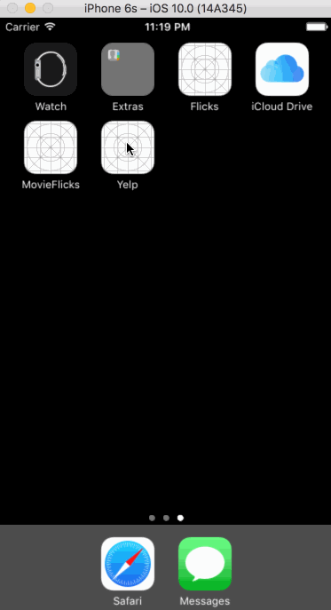

### Basic Yelp client
Time spent: **13** hours spent in total

## User Stories

The following **required** functionality is completed:

- [x] Table rows should be dynamic height according to the content height..
- [x] Custom cells should have the proper Auto Layout constraints
- [x] Search bar should be in the navigation bar
- [x] The filters you should actually have are: category, sort (best match, distance, highest rated), distance, deals (on/off)
- [x] The filters table should be organized into sections as in the mock
- [x] Clicking on the "Search" button should dismiss the filters page and trigger the search w/ the new filter settings

The following **optional** features are implemented:

- [x] Implement map view of restaurant results

## Video Walkthrough

Here's a walkthrough of implemented user stories:



**Enhancements TODO** :
- [] Infinite scroll for restaurant results
- [] Right lable alignment fix in orientation change
- [] Implement custom switch
- [] Distance filter should expand as in the real Yelp app
- [] Categories should show a subset of the full list with a "See All" row to expand.


This is a headless example of how to implement an OAuth 1.0a Yelp API client. The Yelp API provides an application token that allows applications to make unauthenticated requests to their search API.

### Sample request

**Basic search with query**

```
Business.searchWithTerm("Thai", completion: { (businesses: [Business]!, error: NSError!) -> Void in
    self.businesses = businesses
    
    for business in businesses {
        print(business.name!)
        print(business.address!)
    }
})
```

**Advanced search with categories, sort, and deal filters**

```
Business.searchWithTerm("Restaurants", sort: .Distance, categories: ["asianfusion", "burgers"], deals: true) { (businesses: [Business]!, error: NSError!) -> Void in

    for business in businesses {
        print(business.name!)
        print(business.address!)
    }
}
```
